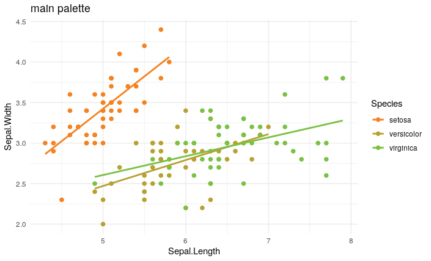

```
library(ggplot2)
library(RanchoStyle)

p <- ggplot(iris, aes(x=Sepal.Length, y=Sepal.Width, color = Species)) +
  geom_point(size = 2) +
  geom_smooth(formula = 'y ~ x', method = 'glm', se = F)+
  theme_minimal()

p + scale_color_rancho() +
  labs(title='main palette')
```


