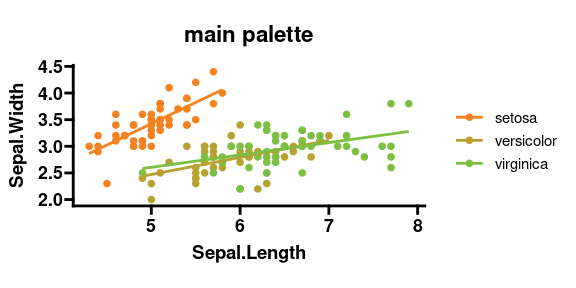

Please see the [vignette](https://ranchobiosciences.github.io/EasyBranding/) for full configuration and usage.

```
library(EasyBranding)
library(ggplot2)
library(ggprism)

theme_set(theme_prism() + theme(aspect.ratio = 0.4))
p <- ggplot(iris, aes(x=Sepal.Length, y=Sepal.Width, color = Species)) +
  geom_point(size = 2) +
  geom_smooth(formula = 'y ~ x', method = 'glm', se = F)

p + scale_color_brand() + 
  labs(title='main palette')
```


